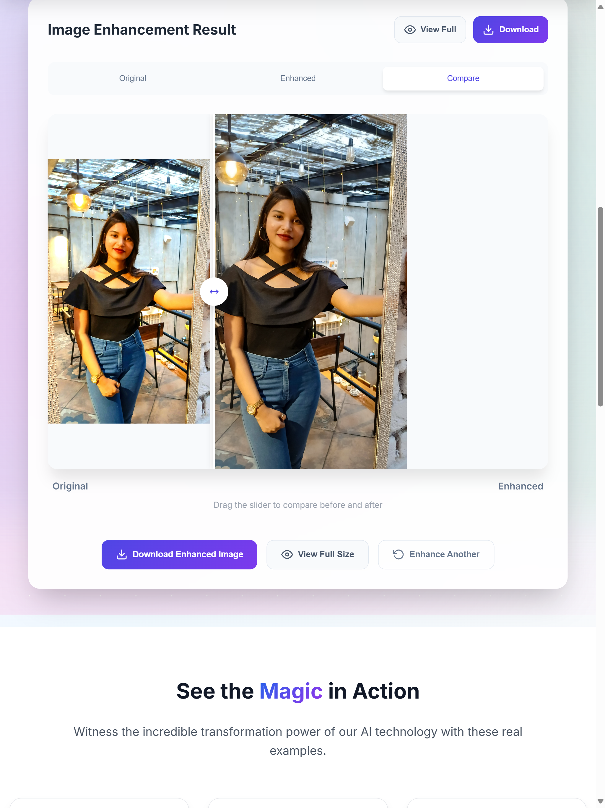
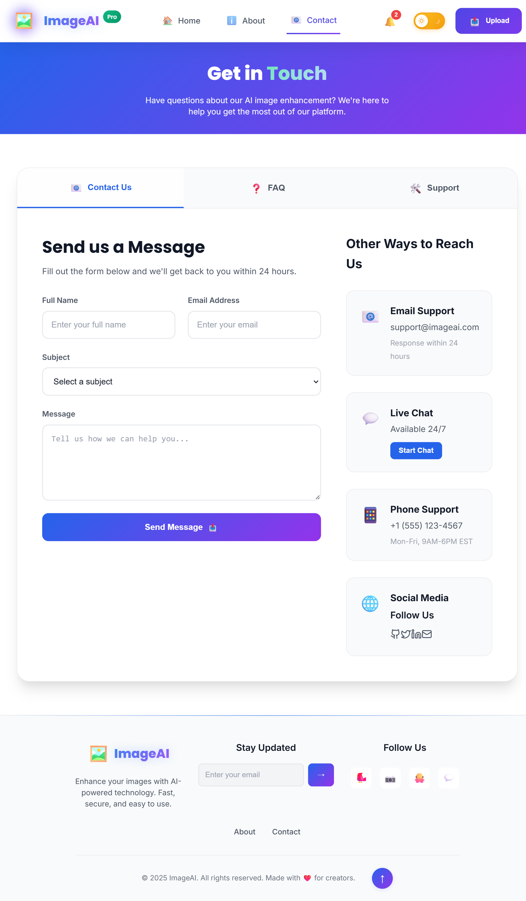
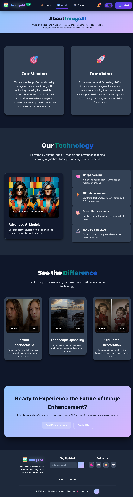
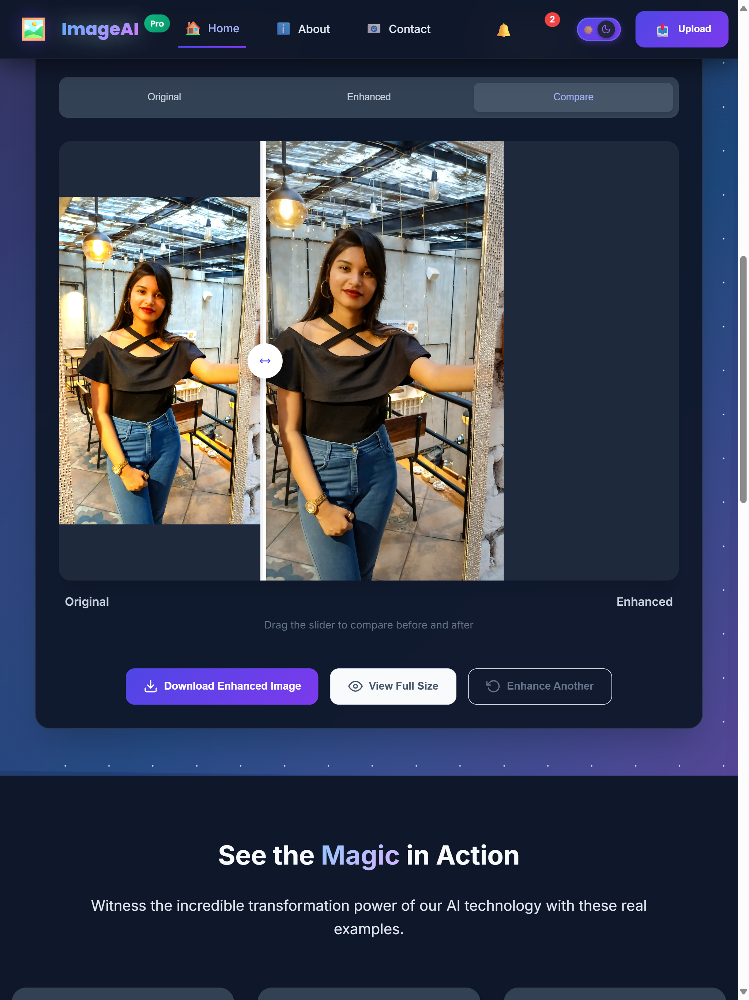
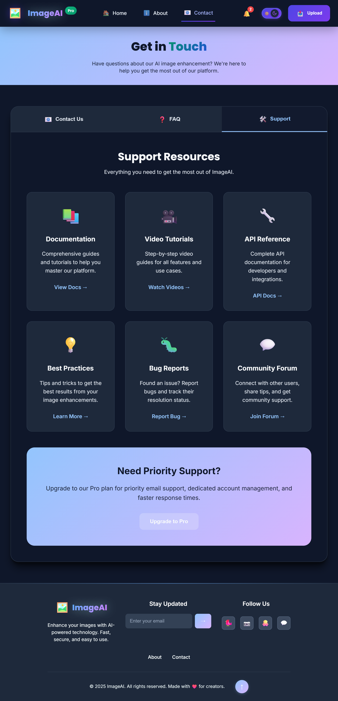

<h1 align="center">🖼️ Image Enhancer Web App</h1>

<p align="center">
  
  
   
</p>

<p align="center">
  <a href="https://image-enhancer-ten-psi.vercel.app/" target="_blank">
    🔗 <strong>Live Demo</strong>
  </a>
  • ⭐ <a href="https://github.com/subhasmita-puja/3D-Gaming-Website/stargazers">Give a Star</a>
</p>


> **IMAGE Enhancer** is your ultimate tool for making photos clearer, sharper, and more vibrant — all from your browser. It allows users to effortlessly upload and compare images side-by-side with smooth transitions and a clean, responsive UI. Designed with future integration in mind, the app is prepared for powerful AI APIs like image upscaling, sharpening, and denoising—making it perfect for photographers, designers, and developers looking for fast, browser-based image improvements with dark/light theme support and real-time previews. **React** and **Tailwind CSS** delivers professional-level image enhancement with ease.

🌐 [**Live Website →**](https://image-enhancer-ten-psi.vercel.app/)

---

## 🚀 Features

- 🖼️ **Original vs Enhanced:** Preview your original and enhanced images side-by-side
- 📤 **Upload & Enhance:** Drag & drop or browse to upload your image instantly
- 🔍 **Compare View:** Easily toggle between before/after results
- ⚙️ **Enhancement Settings:** AI-ready design for future integration with upscaling, sharpening & denoising
- 🌗 **Dark & Light Mode:** Automatically or manually switch theme for comfortable viewing
- 🎯 **Frontend Stack:** – Built using React, Tailwind CSS, JavaScript, and Next.js
-🌍 **Live Deployed:** – Hosted on Vercel for seamless performance
- 🎨 **Responsive UI:** Fully responsive design for all screen sizes
- 🔄 **Smooth Transitions:** – Sleek animations for a premium feel
-🧠 **Scalable for Future:** – Ready to extend with sliders, batch processing, or download options

---

## 🛠️ Built With

- **React.js** – For building reusable UI components
- **Tailwind CSS** – Utility-first framework for quick styling
- **JavaScript (ES6)** – Functional logic and rendering
- **Vercel** – Lightning-fast deployment and hosting

---

## 🌐 Live Demo

👉 [https://image-enhancer-ten-psi.vercel.app/](https://image-enhancer-ten-psi.vercel.app/)

---

## 📸 Screenshots

### 🌞 Light Theme

| Home Page|  | About Page |  | Compare View |  | Contact Page |  

---
### 🌚 Dark Theme

| Home Page 
|  |
 About Page |  |
  Compare View | |
  Contact Page |


---

## 🧑‍💻 Getting Started

To run this project locally:

```bash
git clone https://github.com/your-username/image-enhancer.git
cd image-enhancer
npm install
npm start
```

The app will be available at `http://localhost:3000`.

---

## 📂 Project Structure

```plaintext
.
├── public/
├── src/
│   ├── components/
│   ├── assets/
│   ├── App.jsx
│   ├── index.js
├── tailwind.config.js
├── package.json
└── README.md
```

---

## 🧩 Future Improvements

- Integrate AI enhancement APIs (e.g., Let's Enhance, Remini, DeepAI)
- Add slider-based before/after comparison
- Export high-resolution downloads
- Batch processing and image history

---

## 🙋‍♀️ About Me

**Subhasmita Sahoo**  
Frontend Developer | UI/UX Enthusiast | 3D Webdev


📍 Khordha, Odisha  
📫 Email: subhasmita4602@gmail.com  
🔗 [LinkedIn](https://www.linkedin.com/in/subhasmita-sahoo-puja) |
[Github](https://github.com/subhasmita-puja)
---

## 🌟 Show Your Support
⭐ If you found this project useful, **star it**, **share it**, and give feedback!

## 📜 License

This project is licensed under the MIT License.
